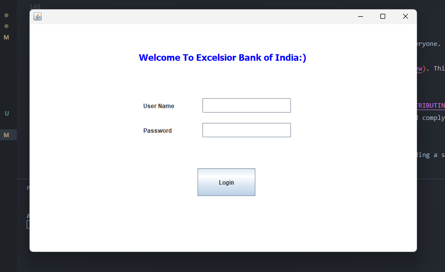

<div align="center">

# Excelsior Bank of India - Online Banking System

<p id="intro">Excelsior Bank of India is an academic project that simulates an online banking system. Developed using Java Swing, this project provides a user-friendly interface for managing various banking operations such as account management, transactions, and balance inquiries.</p>

### Supported Platforms

[]()
[]()
[]()

---

<p>

<span>
  <a href="https://github.com/darsan-in/Online-Banking-System/commits/main">
    
  </a>
</span>

<span>
  <a href="">
    
  </a>
</span>

</p>

---

<p>

<span>
  <a href="LICENSE">
    
  </a>
</span>

<span>
  <a href="https://github.com/darsan-in/Online-Banking-System/releases">
    
  </a>
</span>

</p>

<p>

<span>
  <a href="https://www.codefactor.io/repository/github/darsan-in/Online-Banking-System/issues/main">
    
  </a>
</span>

</p>

---

<p>

<span>
  <a href="">
    
  </a>
</span>

<span>
  <a href="https://github.com/sponsors/darsan-in">
    
  </a>
</span>

</p>

---

</div>

## Table of Contents 📝

- [Features and Benefits](#features-and-benefits-)
- [Use Cases](#use-cases-)
- [Friendly request to users](#-friendly-request-to-users)

- [Installation - Step-by-Step Guide](#installation---step-by-step-guide-)
- [In-Action](#in-action-)

- [License](#license-%EF%B8%8F)
- [Contributing to Our Project](#contributing-to-our-project-)

- [Contact Information](#contact-information)

## Features and Benefits ✨

- User account management
- Secure transaction processing
- Balance inquiry and account statements
- Java Swing-based graphical user interface
- Simulated banking environment for educational purposes
- Robust and easy-to-navigate system

## Use Cases ✅

- Simulating online banking operations for academic purposes
- Demonstrating Java Swing application development
- Managing user accounts, transactions, and balances in a controlled environment
- Learning and practicing secure coding techniques in Java
- Exploring GUI-based application development in Java

---

### 🙏🏻 Friendly Request to Users

Every star on this repository is a sign of encouragement, a vote of confidence, and a reminder that our work is making a difference. If this project has brought value to you, even in the smallest way, **please consider showing your support by giving it a star.** ⭐

_"Star" button located at the top-right of the page, near the repository name._

Your star isn’t just a digital icon—it’s a beacon that tells us we're on the right path, that our efforts are appreciated, and that this work matters. It fuels our passion and drives us to keep improving, building, and sharing.

If you believe in what we’re doing, **please share this project with others who might find it helpful.** Together, we can create something truly meaningful.

Thank you for being part of this journey. Your support means the world to us. 🌍💖

---

## Installation - Step-by-Step Guide 🪜

- **Step 1:** Clone this repository

```bash
git clone https://github.com/darsan-in/Online-Banking-System.git
```

- **Step 2:** Set up eclipse IDE if not already.
- **Step 3:** Open this project in eclipse IDE.
- **Step 4:** Follow this to export app as jar output - [link](https://help.eclipse.org/latest/index.jsp?topic=%2Forg.eclipse.jdt.doc.user%2Ftasks%2Ftasks-37.htm)
- **Step 5:** Now you can run the jar app.

```bash
cd output
java -jar EBI.jar
```

## In-Action 🤺

[](https://github.com/darsan-in/Online-Banking-System/raw/main/in-action/EBI.mp4)

## License ©️

This project is licensed under the [MIT](LICENSE).

## Contributing to Our Project 🤝

We’re always open to contributions and fixing issues—your help makes this project better for everyone.

If you encounter any errors or issues, please don’t hesitate to [raise an issue](../../issues/new). This ensures we can address problems quickly and improve the project.

For those who want to contribute, we kindly ask you to review our [Contribution Guidelines](CONTRIBUTING) before getting started. This helps ensure that all contributions align with the project's direction and comply with our existing [license](LICENSE).

We deeply appreciate everyone who contributes or raises issues—your efforts are crucial to building a stronger community. Together, we can create something truly impactful.

Thank you for being part of this journey!

## Contact Information

For any questions, please reach out via hello@darsan.in or [LinkedIn](https://www.linkedin.com/in/darsan-in/).

---

<p align="center">

<span>
<a href="https://www.linkedin.com/in/darsan-in/"></a>
</span>

<span>
  
</span>

<span>
<a href="https://www.youtube.com/@darsan-in"></a>
</span>

<span>
  
</span>

<span>
<a href="https://www.facebook.com/darsan.in/"></a>
</span>

<span>
  
</span>

<span>
<a href="https://www.npmjs.com/~darsan.in"></a>
</span>

<span>
  
</span>

<span>
<a href="https://github.com/darsan-in"></a>
</span>

<span>
  
</span>

<span>
<a href="https://huggingface.co/darsan"></a>
</span>

<span>
  
</span>

<span>
<a href="https://www.reddit.com/user/iamspdarsan/"></a>
</span>

<span>
  
</span>

<span>
<a href="https://darsan.in/"></a>
</span>

<p>

---

#### Topics

<ul id="keywords">
<li>online banking</li>
<li>Java Swing</li>
<li>banking system</li>
<li>academic project</li>
<li>banking simulation</li>
<li>account management</li>
<li>secure transactions</li>
<li>Java GUI</li>
<li>banking software</li>
<li>educational project</li>
<li>user interface</li>
<li>transaction processing</li>
<li>balance inquiry</li>
<li>Java application</li>
<li>banking operations</li>
<li>Java project</li>
<li>GUI development</li>
<li>bank simulation</li>
<li>software development</li>
<li>financial application</li>
</ul>
